# AI Teaching Video Platform

K12 教学视频生成与分享管理平台


> 按学科知识点驱动，把「分镜 → 配音 → 渲染 → 审核 → 入库」做成可复用的本地可控系统，而不是只调一个文生视频 API。

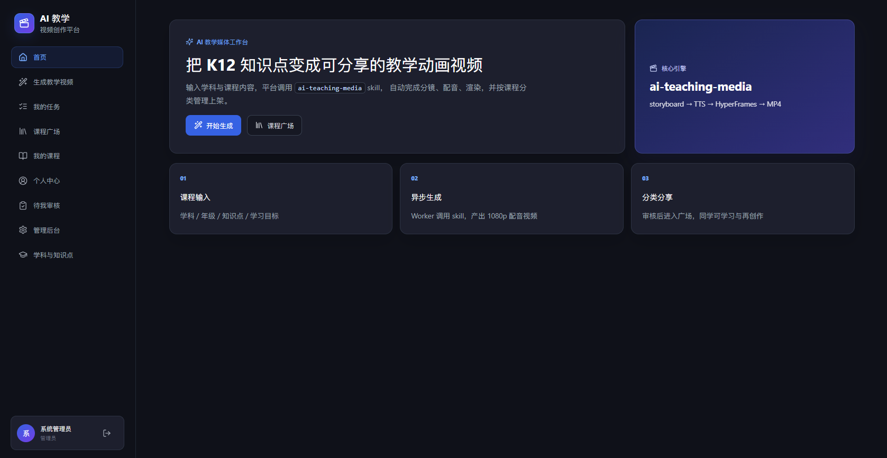

## 演示视频

先看 30 秒到 2 分钟样片，比只看截图更容易理解「知识点 → 教学动画视频」的效果。

### 重要说明：GitHub README 本身不能可靠内嵌播放 mp4

GitHub 渲染 `README.md` 时会过滤/限制 HTML 的 `<video>` 标签，因此把相对路径写成：

```html
<video src="docs/videos/xxx.mp4" controls></video>
```

在仓库网页上通常**无法点开在线播放**（只能变成下载或无法预览）。  
要实现「打开 README → 点链接 → 浏览器在线播放」，需要用 **绝对可访问的媒体 URL** 或 **独立播放页**。

### 🎬 推荐在线播放方式（已可用）

**方式 A：打开在线播放页（多视频切换）**

1. [htmlpreview 在线播放页（无需启用 Pages，推送后即可用）](https://htmlpreview.github.io/?https://github.com/hailaobao2026/ai-teaching-video-platform/blob/main/docs/demo.html)
2. [GitHub Pages 播放页（需先在仓库启用 Pages）](https://hailaobao2026.github.io/ai-teaching-video-platform/demo.html)
3. 本地双击打开：[`docs/demo.html`](docs/demo.html)

**方式 B：直接点 CDN 链接，浏览器原生播放单个 mp4（最稳）**

| 学科 | 主题 | 浏览器在线播放（jsDelivr） | 仓库源文件 |
|------|------|---------------------------|-----------|
| 物理 | 能量守恒定律 | [▶️ 在线播放](https://cdn.jsdelivr.net/gh/hailaobao2026/ai-teaching-video-platform@main/docs/videos/physics-energy-conservation.mp4) | [mp4](docs/videos/physics-energy-conservation.mp4) |
| 数学 | 勾股定理 | [▶️ 在线播放](https://cdn.jsdelivr.net/gh/hailaobao2026/ai-teaching-video-platform@main/docs/videos/math-pythagorean-theorem.mp4) | [mp4](docs/videos/math-pythagorean-theorem.mp4) |
| 化学 | 二氧化碳与石灰水反应 | [▶️ 在线播放](https://cdn.jsdelivr.net/gh/hailaobao2026/ai-teaching-video-platform@main/docs/videos/chemistry-co2-limewater.mp4) | [mp4](docs/videos/chemistry-co2-limewater.mp4) |
| 历史 | 工业革命 | [▶️ 在线播放](https://cdn.jsdelivr.net/gh/hailaobao2026/ai-teaching-video-platform@main/docs/videos/history-industrial-revolution.mp4) | [mp4](docs/videos/history-industrial-revolution.mp4) |
| 语文 | 诗词意象 | [▶️ 在线播放](https://cdn.jsdelivr.net/gh/hailaobao2026/ai-teaching-video-platform@main/docs/videos/chinese-poetry-imagery.mp4) | [mp4](docs/videos/chinese-poetry-imagery.mp4) |

> 推送到 GitHub 后，jsDelivr 可能有短暂缓存延迟（通常几分钟）。若打不开，可在链接中把 `@main` 改成具体 commit SHA。更多案例截图见 [学科案例与演示视频](#学科案例与演示视频)。

### 启用 GitHub Pages（可选，获得更正式的播放域名）

当前仓库已有工作流 [`.github/workflows/pages.yml`](.github/workflows/pages.yml)，但若 Pages 未开启，Actions 会在 `Setup Pages` 失败。请手动：

1. 打开仓库 **Settings → Pages**
2. **Build and deployment → Source** 选择 **GitHub Actions**
3. 重新运行 workflow，或再 push 一次 `main`
4. 访问：[https://hailaobao2026.github.io/ai-teaching-video-platform/demo.html](https://hailaobao2026.github.io/ai-teaching-video-platform/demo.html)

## 项目介绍

用户按学科 / 年级选择或输入知识点，平台异步调用本地 **ai-teaching-media** 技能流水线，生成教学视频、信息图、文章插图、章节解说视频与封面，并将成片按课程分类入库，支持角色化审核、课程广场与学科知识点管理。

工程形态参考 [genai-craft](../genai-craft)：React + Vite、Express + MySQL、异步 Job Worker。  
生成核心不是通用文生视频 API，而是本地 skill：**storyboard → TTS → scaffold → HyperFrames**，可选文生图 Provider。

### 这个项目解决什么问题

做 K12 教学视频，最麻烦的往往不是“会不会剪辑”，而是整条链路太碎：

1. 先找知识点  
2. 再写讲稿  
3. 再配画面  
4. 再配音  
5. 再导出封面 / 信息图  
6. 最后还要审核、归档、分享  

本平台把这条链路做成可复用系统：

```text
学科知识点
  → 教学分镜
  → 语音合成
  → 学科动画
  → 1080p 成片
  → 课程草稿
  → 审核
  → 课程广场
```

与“一句话随机文生视频”不同，这里强调 **知识逻辑和教学表达**：按学科组织内容底座，生成时自动匹配学习目标、动画类型与表达结构。

### 适用场景

- 想把 K12 知识点快速做成可分享教学动画视频  
- 需要学生 / 教师 / 管理员角色与审核流的教育内容平台  
- 希望本地可控地跑通「分镜 → 配音 → 渲染 → 入库」  
- 需要学科知识点目录、课程广场与管理端运维能力  

### 核心能力一览

| 能力 | 说明 |
|------|------|
| 角色体系 | 学生 / 教师 / 管理员；教师按授课学科审学生作品；管理员全量审核 |
| 学科知识点目录 | 大类学科 + 子类知识点（章节/主题/摘要/关键词/学习目标/动画包） |
| 七类产出档位 | 完整教学视频、组合包、信息图、插图、解说视频、封面、纯图 |
| 任务中心 | 排队、阶段进度、失败重试/取消、产物查看 |
| 课程广场 | 审核通过后公开展示；管理员可删除 |
| 模型设置 | 个人 TTS / 文生图 / 视频渲染偏好；管理员系统默认 |
| 知识驱动动画 | 分镜质量门禁 + 学科 SVG 零件动画（光/力/电/化学/地理/历史等） |

## 功能清单

| 功能名称 | 功能说明 | 技术栈 | 状态 | 版本 |
|---------|---------|--------|------|------|
| 学科与知识点管理 | 学科/年级/章节/知识点检索与管理端批量同步 | Express + MySQL | ✅ 可用 | v0.1.0 |
| 生成教学视频 | 七类 outputProfile，异步 Job + Worker 出片 | ai-teaching-media + HyperFrames | ✅ 可用 | v0.1.0 |
| 我的任务 | 排队/阶段进度/重试/取消/产物预览 | Node Worker | ✅ 可用 | v0.1.0 |
| 我的课程 | 草稿、提交审核、审核意见、状态流转 | React + Express | ✅ 可用 | v0.1.0 |
| 课程广场 | 审核通过后公开播放与筛选 | React SPA | ✅ 可用 | v0.1.0 |
| 角色与 RBAC 审核 | 学生→学科教师；教师→管理员；无对口教师兜底 | Express RBAC | ✅ 可用 | v0.1.0 |
| 个人模型设置 | TTS/文生图/视频质量偏好与任务 modelSnapshot | MySQL + API | ✅ 可用 | v0.1.0 |
| 管理端运维 | 用户、全站审核、知识点同步、系统模型默认 | Admin UI | ✅ 可用 | v0.1.0 |
| Docker Compose 交付 | MySQL / API / Worker / Web 多服务 | Docker Compose | ✅ 可用 | v0.1.0 |

## 功能详解

### 角色与权限

| 角色 | 能做什么 |
|------|----------|
| 学生 | 注册学习账号；生成视频；管理个人课程；提交审核；在课程广场学习 |
| 教师 | 注册并选择授课学科；生成教学媒体；**仅审核本学科学生作品** |
| 管理员 | 全站审核、用户治理、学科知识点维护、任务运维、系统模型默认配置 |

审核规则（摘要）：

- 学生作品 → 对应学科教师审核  
- 教师作品 → 管理员审核  
- 无对口教师时 → 管理员兜底  

### 主使用流程

```text
登录
 → 进入「生成教学视频」
 → 选择学科 / 年级 / 章节 / 知识点
 → 选择产出档位、TTS、文生图 Provider
 → 提交任务
 → 在「我的任务」查看进度与产物
 → 自动/手动形成「我的课程」草稿
 → 提交审核
 → 审核通过后进入「课程广场」
```

首页与登录页示例：


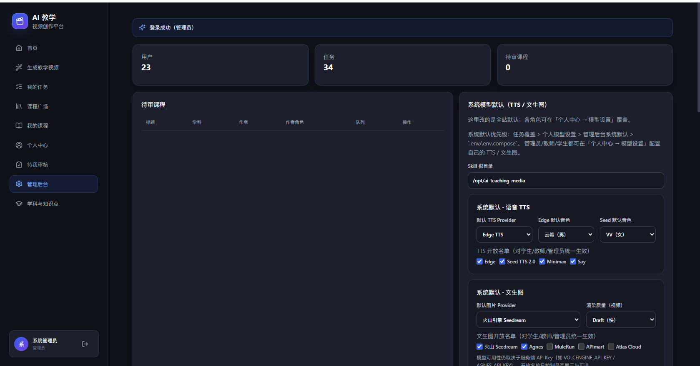

### 1. 学科与知识点管理

内容底座模块。把学科、年级、章节、知识点、学习目标和动画资源组织成结构化知识库，减少手工写复杂提示词。

能力要点：

- 学科大类：语文、数学、英语、物理、化学、生物、地理、历史、政治  
- 知识点字段：章节、主题、摘要、关键词、学习目标、关联动画包  
- 生成页支持下拉选择 / 关键字搜索  
- 管理端支持批量同步：动画知识包、ChemAIForge 化学、初中语数外史地政等  

用户选择一个知识点后，系统可自动完成：

1. 教学目标提取  
2. 知识分镜设计  
3. 学科动画匹配  
4. 语音合成  
5. 视频渲染  

> 详见 [docs/knowledge-catalog.md](docs/knowledge-catalog.md)

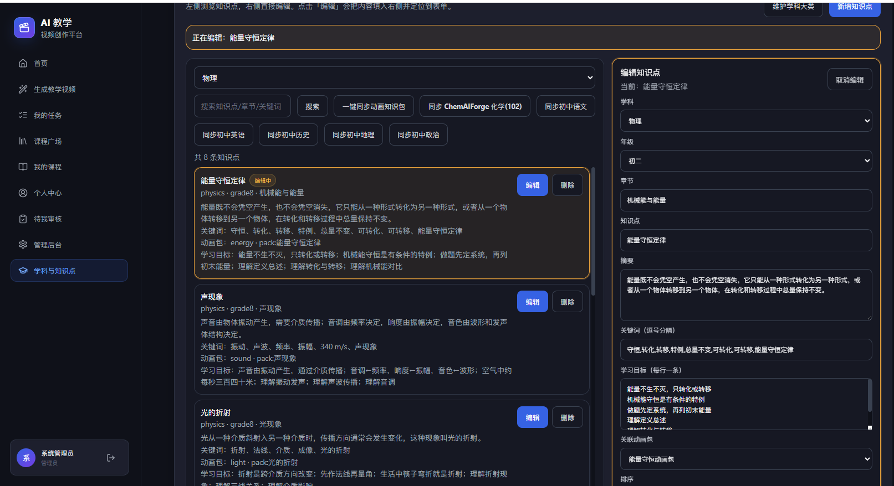

### 2. 生成教学视频（核心）

用户只需选择学科、年级、章节和知识点，系统读取学习目标与动画类型，生成结构化教学分镜，再完成配音、动画场景装配和 1080p 渲染。

推荐操作步骤：

1. 进入「生成教学视频」  
2. 选择学科、年级、章节、知识点 / 课程主题  
3. 选择产出档位（如完整教学视频、视频+信息图+封面）  
4. 选择语音模型：免费 `edge-tts`，或 Seed TTS 等  
5. 如需图片/封面，选择 Agnes / Seedream 等 Provider  
6. 提交任务，到「我的任务」查看进度  
7. 生成成功后预览视频、封面、信息图、分镜，并形成课程草稿  

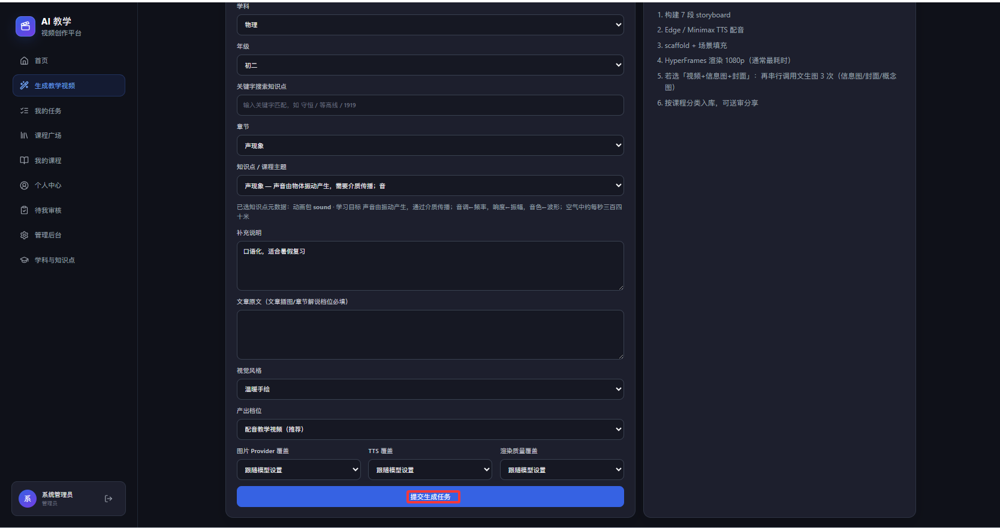

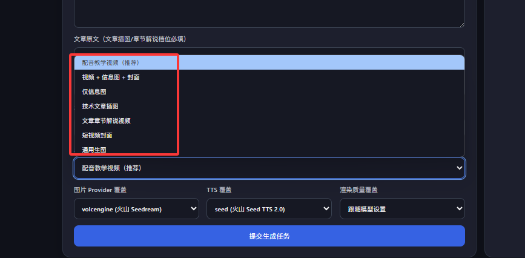

产出档位（`outputProfile`）：

| 档位 | 产物 |
|------|------|
| `teaching_video_full` | 分镜 + TTS + 1080p 配音教学视频 |
| `package_all` | 视频 + 信息图 + 概念图/封面等组合包 |
| `infographic_only` | 9:16 信息图 |
| `tech_article_diagram` | 技术文章插图 |
| `article_explainer_video` | 文章/章节解说视频 |
| `short_video_cover` | 短视频封面 |
| `image_generation` | 纯图片生成 |

生成链路（简版）：

```text
选择知识点
  → 读取学习目标 / 动画包
  → 生成约 7 段教学分镜
  → TTS 配音
  → 学科动画场景装配
  → HyperFrames 渲染 1080p
  → 封面 / 信息图（可选）
  → 入库 + 课程草稿
```

### 3. 我的任务

异步生产控制中心。提交后任务进入后台队列，由独立 Worker 执行，无需停留在生成页等待。

| 阶段 | 进度示意 | 说明 |
|------|----------|------|
| `queued` | 0% | 任务排队 |
| `storyboard` | 10% | 生成教学分镜 |
| `tts` | 30% | 语音合成 |
| `scaffold` | 45% | 教学动画脚手架搭建 |
| `render` | 50%–90% | 1080p 视频渲染 |
| `package` | 95% | 产物打包入库 |
| `succeeded` | 100% | 生成完成 |

支持：查看当前阶段与进度、成功后预览产物、失败后按原参数重试、取消排队或运行中任务。

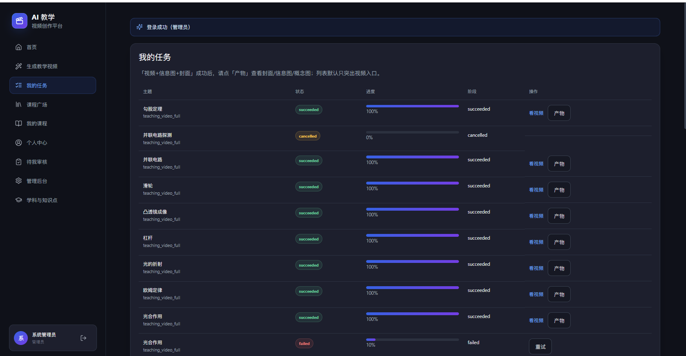

### 4. 我的课程

个人教学作品中心。生成完成后，系统可将视频、封面、学科、年级、章节和知识点整理成课程草稿。

支持：

- 查看课程状态（草稿 / 待审 / 通过 / 驳回）  
- 预览视频与封面  
- 提交审核  
- 阅读教师 / 管理员审核意见  
- 审核通过后进入课程广场  

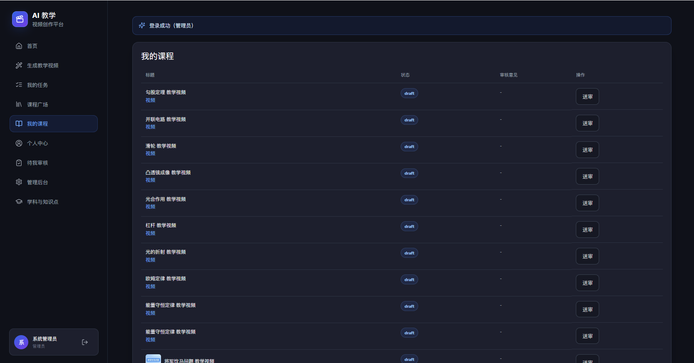

### 5. 课程广场

公开内容中心。审核通过的课程以封面、视频、学科、年级、章节、作者信息公开展示。

支持按学科 / 年级筛选、搜索课程、在线播放；管理员可删除不当内容。

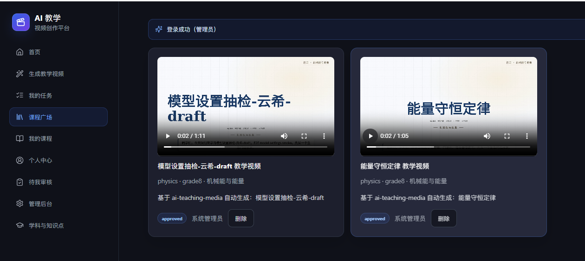

### 6. 个人中心与模型设置

用户可在个人中心配置 TTS / 文生图 / 视频渲染偏好；创建任务时固化 `modelSnapshot`，保证同一任务生成过程模型一致。

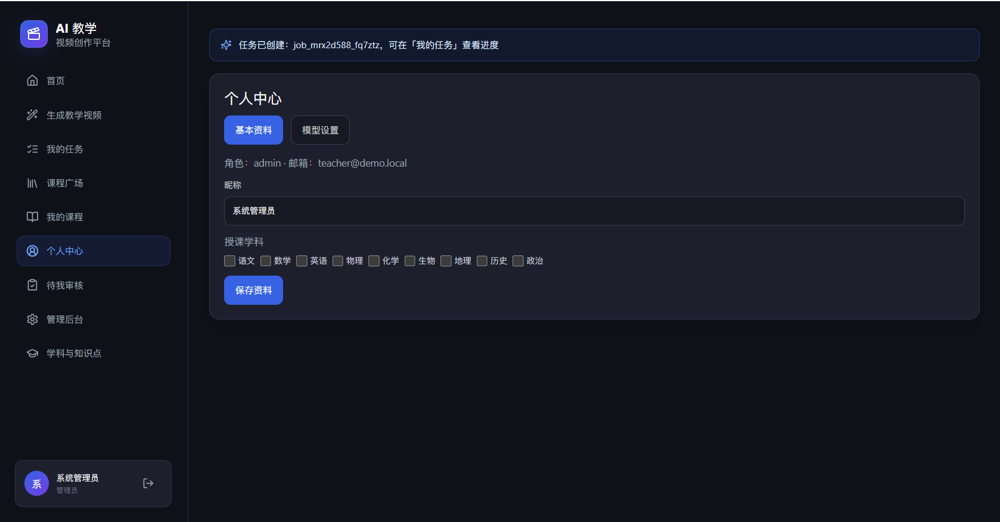

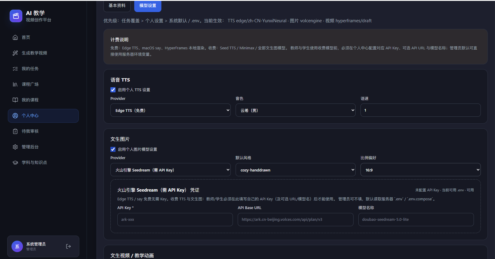

### 7. 管理端

管理员可进行用户治理、全站审核、学科知识点维护与批量同步、系统模型默认配置。

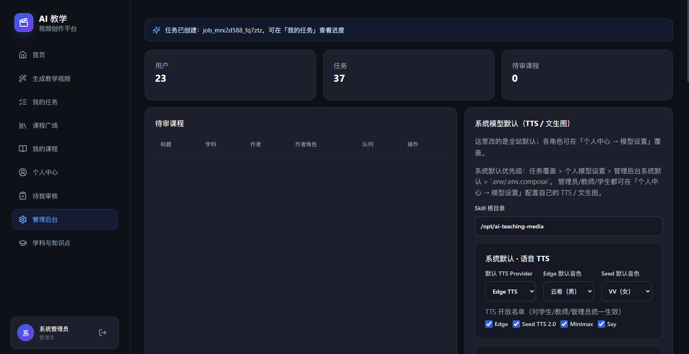

### 学科案例与演示视频

平台按学科知识逻辑出片。下面是真实生成样例。  
**在线播放请点 CDN 链接**（浏览器直接播放）；相对路径的 `<video>` 在 GitHub README 中通常无法内嵌播放。

| 学科 | 主题示例 | 浏览器在线播放 | 强调点 | 适用场景 |
|------|----------|----------------|--------|----------|
| 物理 | 能量守恒定律 | [▶️ 播放](https://cdn.jsdelivr.net/gh/hailaobao2026/ai-teaching-video-platform@main/docs/videos/physics-energy-conservation.mp4) | 定义、转化、条件辨析 | 概念突破、复习导入 |
| 数学 | 勾股定理 | [▶️ 播放](https://cdn.jsdelivr.net/gh/hailaobao2026/ai-teaching-video-platform@main/docs/videos/math-pythagorean-theorem.mp4) | 定理、几何意义、解题步骤 | 课堂导入、错题前重讲 |
| 化学 | 二氧化碳与石灰水反应 | [▶️ 播放](https://cdn.jsdelivr.net/gh/hailaobao2026/ai-teaching-video-platform@main/docs/videos/chemistry-co2-limewater.mp4) | 现象、原理、检验方法 | 实验预习、现象判断 |
| 历史 | 工业革命 | [▶️ 播放](https://cdn.jsdelivr.net/gh/hailaobao2026/ai-teaching-video-platform@main/docs/videos/history-industrial-revolution.mp4) | 背景、过程、影响、评价 | 单元串讲、复习提纲 |
| 语文 | 诗词意象 | [▶️ 播放](https://cdn.jsdelivr.net/gh/hailaobao2026/ai-teaching-video-platform@main/docs/videos/chinese-poetry-imagery.mp4) | 意象、象征、情感、答题方法 | 古诗鉴赏、课前导入 |

[▶️ 打开多视频在线播放页（htmlpreview）](https://htmlpreview.github.io/?https://github.com/hailaobao2026/ai-teaching-video-platform/blob/main/docs/demo.html) · [GitHub Pages 播放页](https://hailaobao2026.github.io/ai-teaching-video-platform/demo.html)

#### 演示视频总览

> 下列链接可在浏览器中直接流式播放（jsDelivr CDN）。仓库相对路径仅用于本地/克隆后预览。

**1. 物理 · 能量守恒定律**

```text
学科=物理  年级=初二  章节=机械能与能量  主题=能量守恒定律
学习目标：理解能量守恒；区分机械能守恒与能量守恒
outputProfile=teaching_video_full
```

常见 7 段结构：引入 → 核心概念 → 过程拆解 → 因果关系 → 生活例子 → 方法步骤 → 总结。

**[▶️ 浏览器在线播放 physics-energy-conservation.mp4](https://cdn.jsdelivr.net/gh/hailaobao2026/ai-teaching-video-platform@main/docs/videos/physics-energy-conservation.mp4)**  
[仓库源文件](docs/videos/physics-energy-conservation.mp4)

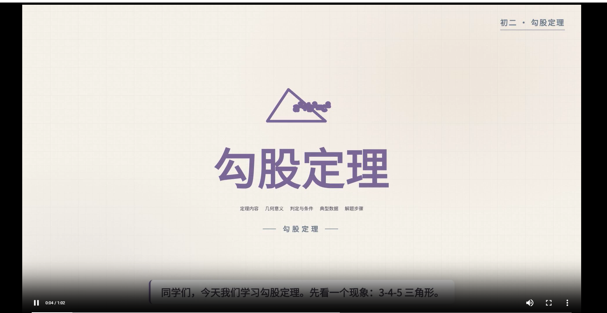


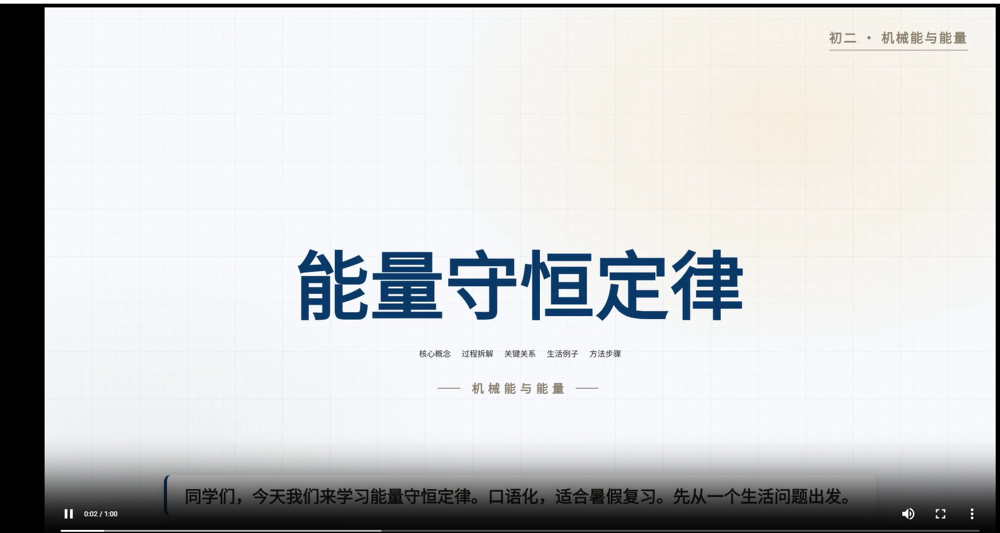

**2. 数学 · 勾股定理**

**[▶️ 浏览器在线播放 math-pythagorean-theorem.mp4](https://cdn.jsdelivr.net/gh/hailaobao2026/ai-teaching-video-platform@main/docs/videos/math-pythagorean-theorem.mp4)**  
[仓库源文件](docs/videos/math-pythagorean-theorem.mp4)

**3. 化学 · 二氧化碳与石灰水反应**

**[▶️ 浏览器在线播放 chemistry-co2-limewater.mp4](https://cdn.jsdelivr.net/gh/hailaobao2026/ai-teaching-video-platform@main/docs/videos/chemistry-co2-limewater.mp4)**  
[仓库源文件](docs/videos/chemistry-co2-limewater.mp4)

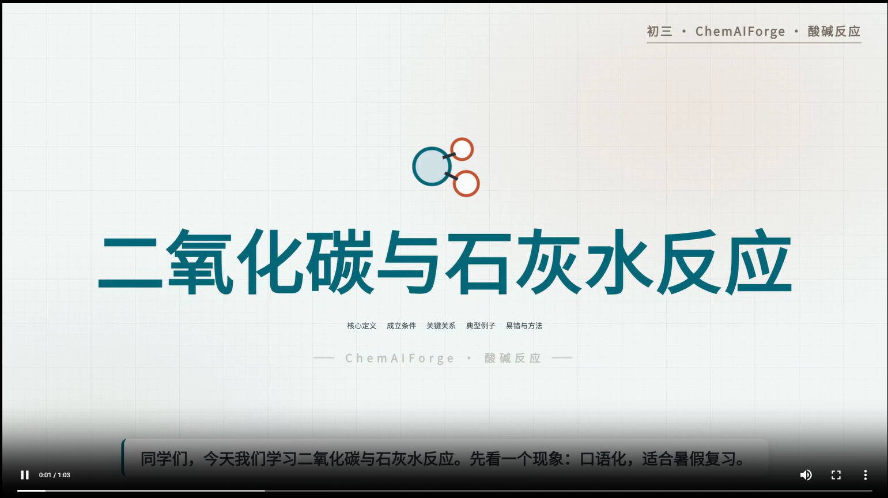

**4. 历史 · 工业革命**

**[▶️ 浏览器在线播放 history-industrial-revolution.mp4](https://cdn.jsdelivr.net/gh/hailaobao2026/ai-teaching-video-platform@main/docs/videos/history-industrial-revolution.mp4)**  
[仓库源文件](docs/videos/history-industrial-revolution.mp4)

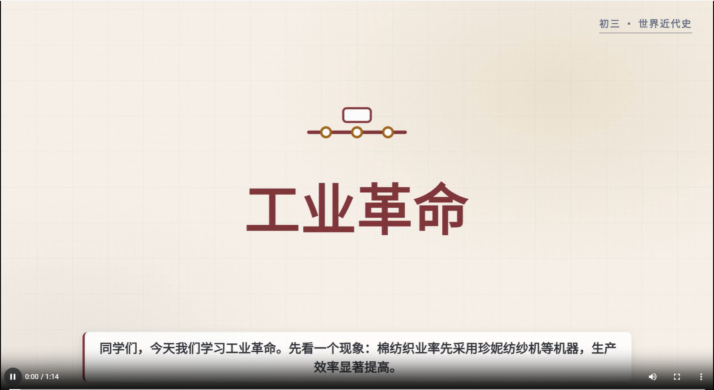

**5. 语文 · 诗词意象**

**[▶️ 浏览器在线播放 chinese-poetry-imagery.mp4](https://cdn.jsdelivr.net/gh/hailaobao2026/ai-teaching-video-platform@main/docs/videos/chinese-poetry-imagery.mp4)**  
[仓库源文件](docs/videos/chinese-poetry-imagery.mp4)

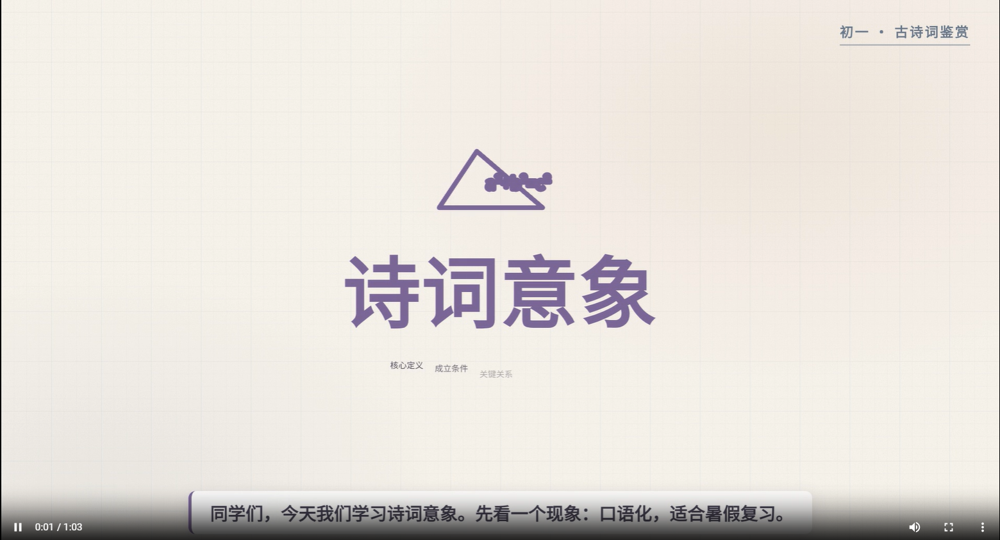

> **不是让 AI 随便生成一段“像课”的视频，而是让不同学科按自己的知识逻辑出片。**

### 功能全景图

```text
┌──────────────────────────────────────────────────────────┐
│ 学生 / 教师 / 管理员                                       │
├──────────────┬───────────────┬───────────────┬───────────┤
│ 生成教学视频  │ 我的任务       │ 我的课程       │ 课程广场   │
│ 知识点选择    │ 进度/重试/产物 │ 草稿/审核/意见 │ 公开学习   │
├──────────────┴───────────────┴───────────────┴───────────┤
│ 管理端：用户 / 全站审核 / 学科知识点 / 同步 / 模型默认      │
└───────────────────────────┬──────────────────────────────┘
                            │
              API + MySQL + Generation Worker
                            │
           ai-teaching-media: storyboard → TTS → render
```

### 已内置知识库（可一键同步）

| 来源 | 学科 | 约量 | 管理端按钮 / API |
|------|------|------|------------------|
| 动画知识包 `KNOWLEDGE_PACKS` | 多学科 | 20+ | 一键同步动画知识包 |
| mathviz 入门+基础 | 数学 | 14 | 入库于 catalog 种子 |
| ChemAIForge 实验 | 化学 | 102 | 同步 ChemAIForge 化学(102) |
| 初中语文 | 语文 | 65 | 同步初中语文 |
| 初中英语 | 英语 | 52 | 同步初中英语 |
| 初中历史 | 历史 | 32 | 同步初中历史 |
| 初中地理 | 地理 | 26 | 同步初中地理 |
| 初中政治/道德与法治 | 政治 | 28 | 同步初中政治 |

年级字典：`grade1`–`grade12`（小学至高中）。详见 [docs/knowledge-catalog.md](docs/knowledge-catalog.md)。

## 技术栈

### 前端

| 技术 | 版本 | 用途 |
|------|------|------|
| React | 19 | SPA 界面 |
| Vite | 6 | 开发与构建 |
| TypeScript | 5.7+ | 类型安全 |
| lucide-react | 0.468+ | 图标 |

### 后端

| 技术 | 版本 | 用途 |
|------|------|------|
| Node.js | 20+ / 22 推荐 | 运行时 |
| Express | 4.21+ | REST API |
| mysql2 | 3.11+ | MySQL 访问 |
| dotenv | 16+ | 环境变量 |

### 生成与渲染

| 技术 | 用途 |
|------|------|
| ai-teaching-media（本地 skill） | 分镜 / TTS / scaffold / 学科动画 |
| HyperFrames | HTML/CSS 动画帧渲染为 MP4 |
| Chrome headless / Playwright | 渲染浏览器 |
| ffmpeg | 音视频合成 |
| Edge TTS / Seed TTS / Minimax | 语音合成 |
| Agnes / Volcengine Seedream 等 | 可选文生图 |

### 基础设施

| 技术 | 用途 |
|------|------|
| MySQL 8 | 持久化（亦可内存库开发） |
| Docker Compose | mysql / api / worker / web 交付 |
| nginx | 前端静态资源与 `/api` 反代 |

### 技术架构

```text
┌──────────────────────────┐
│  Web (React + Vite)      │
│  :3000  用户端 / 管理端   │
└─────────────┬────────────┘
              │ REST JSON
┌─────────────▼────────────┐
│  API Server (Express)    │
│  Auth · Course · Job     │
│  Catalog · Admin · Upload│
└──────┬───────────┬───────┘
       │           │
┌──────▼─────┐ ┌───▼────────────┐
│  MySQL 8   │ │ Object Storage │
│ users/jobs │ │ mp4/png/json   │
└────────────┘ └───────▲────────┘
                       │
┌──────────────────────┴────────┐
│ Generation Worker (Node)      │
│ queued → pipeline → 回写状态   │
└──────────────┬────────────────┘
               │
┌──────────────▼────────────────┐
│ ai-teaching-media skill       │
│ storyboard → TTS → scaffold   │
│ → HyperFrames render → mp4    │
└───────────────────────────────┘
```

为什么用异步 Job + Worker：教学视频生成通常 2–10 分钟（TTS + 逐帧渲染），不能放在同步 HTTP 请求里。Worker 默认并发 1，开发时请单独进程运行。

关键路径：

- `server/services/teachingMediaPipeline.js`
- `server/workers/teachingMediaWorker.js`
- `docs/architecture.md`

## 项目结构

```text
ai-teaching-video-platform/
├── App.tsx / types.ts / styles.css   # 前端 SPA
├── services/                         # 前端 API client
├── components/                       # 前端组件
├── dist/                             # 构建产物（nginx 挂载）
├── deploy/nginx.conf                 # 反代 /api → api:3002
├── server/
│   ├── index.js                      # API 入口
│   ├── db.js                         # MySQL / memory
│   ├── routes/                       # 路由
│   ├── services/                     # pipeline、catalog、rbac…
│   ├── workers/teachingMediaWorker.js
│   ├── data/                         # 知识库种子 JSON、jobs
│   ├── tests/                        # 服务端测试
│   └── uploads/                      # 成片/图片
├── scripts/                          # 启停、compose、冒烟
├── docs/                             # 设计与 API 文档
│   ├── images/                       # README / 产品截图
│   ├── demo.html                      # 演示视频在线播放页
│   └── videos/                       # 演示成片（学科案例 mp4）
├── docker-compose.yml
├── Dockerfile
├── .env.example / .env.compose
└── package.json
```

## 安装说明

### 环境要求

| 依赖 | 版本建议 | 说明 |
|------|----------|------|
| Node.js | 20+（推荐 22） | 前端 / API / Worker |
| npm | 随 Node 自带 | 包管理 |
| MySQL | 8.0（可选） | 持久化；开发可用内存库 |
| Python | 3.10+ | skill 内 TTS / 脚本 |
| ffmpeg | 最新稳定版 | 音视频处理 |
| Chrome / chrome-headless-shell | — | HyperFrames 渲染 |
| ai-teaching-media | 本地 skill 目录 | 通过 `TEACHING_MEDIA_ROOT` 指向 |

可选 Provider Key（按需）：`AGNES_API_KEY`、`VOLCENGINE_API_KEY`、`SEED_TTS_API_KEY`、`MINIMAX_API_KEY`、`LLM_API_KEY` 等。**不要把真实 API Key 提交进仓库。**

### 安装步骤

```bash
# 1. 克隆项目
git clone <your-repo-url>/ai-teaching-video-platform.git
cd ai-teaching-video-platform

# 2. 安装前端依赖
npm install

# 3. 安装后端依赖
npm --prefix server install

# 4. 配置环境变量
cp .env.example .env
# 编辑 .env：至少配置 ADMIN_EMAIL / ADMIN_PASSWORD
# 真实出片还需 TEACHING_MEDIA_ROOT、渲染浏览器路径等
```

### 配置说明

关键变量（完整见 `.env.example`）：

| 变量 | 含义 |
|------|------|
| `PORT` | API 端口，默认 `3002` |
| `USE_MYSQL` | `true` 用 MySQL，否则内存库 |
| `MYSQL_HOST` / `MYSQL_PORT` / `MYSQL_*` | MySQL 连接 |
| `TEACHING_MEDIA_ROOT` | ai-teaching-media skill 路径 |
| `ARTIFACTS_ROOT` | 任务工作区 |
| `DEFAULT_TTS_PROVIDER` | 默认 `edge` |
| `DEFAULT_IMAGE_PROVIDER` | 默认 `volcengine` 等 |
| `HYPERFRAMES_FPS` / `HYPERFRAMES_WORKERS` | 渲染性能参数 |
| `HYPERFRAMES_BROWSER_PATH` | Chrome headless 路径 |
| `AGNES_API_KEY` / `VOLCENGINE_API_KEY` / `SEED_TTS_API_KEY` | 可选 Provider Key |
| `ADMIN_EMAIL` / `ADMIN_PASSWORD` | 引导管理员账号 |
| `SEED_DEMO_ACCOUNTS` | 是否注入演示账号 |

## 使用说明

### 快速开始（内存模式，最快验证页面/API）

```bash
# 终端 1：API
npm run dev:server

# 终端 2：Worker（重 CPU 任务，务必单独进程）
npm run dev:worker

# 终端 3：前端
npm run dev
```

或一键三端：

```bash
npm run dev:all
```

打开 [http://localhost:3000](http://localhost:3000)

演示账号（`SEED_DEMO_ACCOUNTS=true` 时）：

| 角色 | 邮箱 | 密码 |
|------|------|------|
| 教师/管理员引导 | `teacher@demo.local` | `demo123`（以 `.env` 为准） |
| 物理教师 | `physics.teacher@demo.local` | `demo123` |
| 学生 | `student@demo.local` | `demo123` |

### 真实出片

确保：

1. `TEACHING_MEDIA_ROOT` 指向本地 `ai-teaching-media` skill  
2. Python / ffmpeg / HyperFrames 可用  
3. `edge-tts` 已安装，或配置 Seed / Minimax  
4. `HYPERFRAMES_BROWSER_PATH` 指向可用浏览器  

成功视频默认落到：

```text
server/uploads/videos/<jobId>.mp4
```

### 推荐：脚本启动后端

Windows 盘符挂载（如 `/mnt/f/...`）时，直接在该盘跑 API/Worker 可能不稳定。推荐：

```bash
npm run start:backend
# 或
bash scripts/start-api.sh
bash scripts/start-worker.sh
bash scripts/status-services.sh
bash scripts/stop-services.sh
```

### MySQL 与 Compose

仅 MySQL 容器 + 宿主 API/Worker：

```bash
npm run compose:mysql
npm run start:mysql-stack   # 默认 API :3013
```

完整 compose（mysql + api + worker，可选 web）：

```bash
# Docker Hub 不通时可指定镜像源
# export NODE_IMAGE=docker.m.daocloud.io/library/node:22-bookworm
# export MYSQL_IMAGE=docker.m.daocloud.io/library/mysql:8.0
npm run compose:up
# 带前端：WITH_WEB=1 npm run compose:up
npm run compose:down
```

默认：

- API：`http://127.0.0.1:3002`
- MySQL：`127.0.0.1:3307`
- 演示账号：`teacher@demo.local` / `demo123`

### 常用脚本

| 命令 | 说明 |
|------|------|
| `npm run dev` | 启动前端 Vite |
| `npm run dev:server` | 启动 API（watch） |
| `npm run dev:worker` | 启动 Worker |
| `npm run dev:all` | 同时启动三端 |
| `npm run build` | 前端生产构建 |
| `npm test` | 服务端测试 |
| `npm run test:p4` | RBAC / 审核等回归 |
| `npm run compose:up` / `compose:down` | Compose 启停 |
| `npm run start:backend` | 脚本启动 API + Worker |

### 使用示例（业务路径）

1. 使用演示教师账号登录  
2. 进入「生成教学视频」  
3. 选择 `物理 / 初二 / 机械能与能量 / 能量守恒定律`  
4. 产出档位选 `teaching_video_full`，TTS 选 `edge`  
5. 提交任务，在「我的任务」等待 `succeeded`  
6. 预览成片，形成课程草稿并提交审核  
7. 管理员/对口教师审核通过后，在「课程广场」查看  

## 文档地址

| 文档 | 内容 |
|------|------|
| [docs/getting-started.md](docs/getting-started.md) | 上手与联调 |
| [docs/architecture.md](docs/architecture.md) | 系统架构 |
| [docs/api.md](docs/api.md) | REST API |
| [docs/pipeline.md](docs/pipeline.md) | 生成流水线 |
| [docs/knowledge-catalog.md](docs/knowledge-catalog.md) | 学科与知识点目录 |
| [docs/data-model.md](docs/data-model.md) | 数据模型 |
| [docs/product.md](docs/product.md) | 产品说明 |
| [docs/PRD.md](docs/PRD.md) | 需求（角色/审核/注册） |
| [docs/user-model-settings.md](docs/user-model-settings.md) | 个人模型设置 |
| [docs/roadmap.md](docs/roadmap.md) | 路线图 |
| [docs/regression-checklist.md](docs/regression-checklist.md) | 回归清单 |
| [docs/概要设计.md](docs/概要设计.md) / [详细设计.md](docs/详细设计.md) | 设计文档 |
| [docs/数据字典.md](docs/数据字典.md) | 字段说明 |

## 开发指南

### 本地开发

```bash
# 前端
npm run dev

# API
npm run dev:server

# Worker（务必独立进程）
npm run dev:worker
```

开发约定：

- 不把 API Key 写入仓库  
- Worker 是重 CPU 任务，开发时单独进程运行  
- 平台不重写 skill 内部逻辑，仅通过 `TEACHING_MEDIA_ROOT` 适配调用  

### 构建部署

```bash
# 前端构建
npm run build

# Docker 交付
npm run compose:up
```

生产建议：

- API / Worker 分离  
- 产物盘使用独立大容量卷  
- Worker 机器强化 CPU + 足够内存  
- 对象存储（MinIO/S3）替换本地 uploads  
- 队列可升级为 Redis/BullMQ（首期 MySQL 抢占足够）  

### 测试

```bash
npm test
npm run test:p4
npm run test:model-settings
npm run smoke:mysql
```

### 贡献指南

1. Fork / 创建特性分支  
2. 保持改动聚焦，遵循现有目录与命名  
3. 不提交 `.env`、密钥与大体量生成产物  
4. 涉及审核/RBAC 时补充或运行 `npm run test:p4`  
5. 提交清晰说明后发起 PR  

## 常见问题

<details>
<summary>安装或启动失败怎么办？</summary>

1. 确认 Node.js 20+，并分别在根目录与 `server/` 执行 `npm install`  
2. 若没有 `.bin` shim，可直接：`node node_modules/vite/bin/vite.js`  
3. Windows 盘符挂载场景优先用 `npm run start:backend`  
4. 检查端口 `3000` / `3002` 是否被占用  

</details>

<details>
<summary>为什么页面能开，但一直不出片？</summary>

1. 确认 Worker 进程在跑：`npm run dev:worker` 或 `scripts/start-worker.sh`  
2. 检查 `TEACHING_MEDIA_ROOT` 是否指向有效 skill  
3. 确认 Python、ffmpeg、edge-tts、浏览器路径可用  
4. 查看任务 `error_message` 与 `logs/` / Worker 控制台输出  

</details>

<details>
<summary>如何切换 MySQL 与内存库？</summary>

- 内存库：`.env` 中 `USE_MYSQL=false`（默认，适合快速验证）  
- MySQL：`USE_MYSQL=true`，并配置 `MYSQL_*`；可用 `npm run compose:mysql` 起库  

</details>

<details>
<summary>如何配置 TTS / 文生图 Provider？</summary>

1. 在 `.env` 配置系统默认：`DEFAULT_TTS_PROVIDER`、`DEFAULT_IMAGE_PROVIDER` 与对应 API Key  
2. 用户可在「个人中心 → 模型设置」覆盖个人偏好  
3. 创建任务时会写入 `modelSnapshot`，避免中途配置漂移  
4. 详见 [docs/user-model-settings.md](docs/user-model-settings.md)  

</details>

<details>
<summary>生图超时或任务一直 running 怎么办？</summary>

可调整：

| 变量 | 默认 | 含义 |
|------|------|------|
| `AGNES_HTTP_TIMEOUT` | 90 | 单次 HTTP 超时（秒） |
| `AGNES_HTTP_RETRIES` | 1 | 网关类错误重试次数 |
| `IMAGE_GEN_TIMEOUT_MS` | ~225000 | generate.py 进程硬超时 |

超时后任务应进入 `failed`，可重试，不应永久 `running`。

</details>

<details>
<summary>演示账号密码是什么？</summary>

默认见 `.env.example`：`teacher@demo.local` / `demo123`（生产前务必修改 `ADMIN_PASSWORD` 与演示密码）。

</details>

## 验证状态（摘录）

- `teaching_video_full` 真实出片（如能量守恒定律）已跑通  
- `package_all` / 图片档位 / 文章解说等档位已联调  
- 角色审核（学科隔离、fallback 管理员队列）已落地  
- 学科知识点目录 + 多科批量入库已可用  
- Compose：`atv-mysql` / `atv-api` / `atv-worker` / `atv-web`  

更细记录见 `progress.md` / `findings.md`。

## 技术交流群

欢迎加入技术交流群，分享你的 Skills 和使用心得：


## 作者联系

- **作者**: 周辉（hailaobao）
- **微信**: laohaibao2025
- **邮箱**: 75271002@qq.com


## 打赏

如果这个项目对你有帮助，欢迎请我喝杯咖啡 ☕

## 项目统计

### 版本信息

- **当前版本**: v0.1.0  
- **主要语言**: TypeScript / JavaScript（Node）  
- **生成引擎**: 本地 ai-teaching-media + HyperFrames  

### 版本历史

- **v0.1.0** (2026-07) - 首个可交付版本：七类产出档位、RBAC 审核、知识点目录、模型设置、Compose 交付与端到端出片闭环  

## 路线图

### 已完成

- [x] 产品/架构/API/数据模型文档与可运行骨架  
- [x] Job + Worker + skill pipeline 闭环  
- [x] 七类产出档位与统一资产登记  
- [x] 角色体系与学科隔离审核  
- [x] 学科知识点目录与多科批量同步  
- [x] 用户模型设置与任务 modelSnapshot  
- [x] Docker Compose 多服务交付  

### 计划功能

- [ ] 管理员系统默认模型与 allowlist 后台完善  
- [ ] 对象存储（MinIO/S3）替换本地 uploads  
- [ ] 队列升级为 Redis/BullMQ（可选）  
- [ ] 更多学科动画包与模板化讲稿  
- [ ] 生产级可观测性（指标、告警、任务仪表盘）  

### 优化计划

- [ ] Worker 并发与低内存渲染策略细化  
- [ ] 审核与越权自动化回归清单持续补齐  
- [ ] 前端体验与课程广场运营能力增强  

详见 [docs/roadmap.md](docs/roadmap.md)。

## License

SPDX-License-Identifier: MIT

本项目采用 MIT 协议开源。在遵守协议的前提下，可自由使用、修改与分发。

## Star History

如果觉得项目不错，欢迎点个 Star ⭐

> 将下方 `OWNER/REPO` 替换为实际上游仓库路径后即可显示趋势图。

[](https://star-history.com/#hailaobao2026/ai-teaching-video-platform&Date)